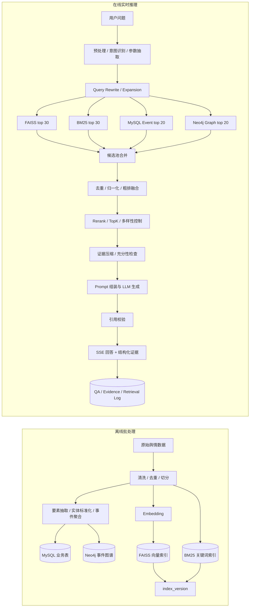

# 桂林旅游舆情智能问答 RAG 系统

系统面向桂林旅游场景中的新闻、评论、投诉与平台舆情数据，采用“离线批处理 + 在线实时推理”的 RAG 架构，把非结构化文本沉淀为可检索、可追溯、可评估的证据资产，并在回答阶段约束大模型只基于充分证据输出结论。

## 项目背景

旅游舆情问答和普通知识库问答的主要区别在于：数据变化快、实体歧义多、事件具有时间性，且回答必须能解释“结论来自哪里”。因此系统没有把 LLM 当作单一问答接口，而是将数据加工、索引构建、混合召回、证据校验、流式回答和日志评估拆成独立模块。

核心能力：

- 支持旅游舆情数据从原文到事件、实体、图谱、向量与关键词索引的统一治理。
- 支持 FAISS、BM25、MySQL 事件、Neo4j 图谱四路召回，提高复杂问题下的召回稳定性。
- 支持独立 Cross-Encoder Rerank、LLM relevance judge 与确定性规则重排的组合排序策略。
- 支持索引版本灰度发布、active 版本切换和异常版本回滚。
- 内置人工标注评测集与检索日志评估链路，持续跟踪 Recall@K、MRR、NDCG 和引用正确率。
- 在证据不足时阻断舆情事实类编造；对非实时通识问题允许降级为通用 LLM 回答并明确无本地证据。
- 保存 QA、证据与检索日志，为命中率、MRR、坏例分析和索引版本回溯提供数据基础。

## 系统架构图



## 核心难点与技术决策

### 1. 为什么离线和在线必须分离

离线链路负责数据质量和索引质量，在线链路负责低延迟推理。二者分离后，数据导入、清洗、抽取、图谱构建和索引构建不会阻塞用户问答；线上推理只读取已经验证过的 active 索引版本，保证召回稳定性。

`index_version` 是线上稳定性的关键。FAISS、BM25 与 chunk 映射统一绑定索引版本，构建新索引时先写入新版本，验证通过后再切换 active 状态；线上始终读取 active 版本。灰度发布时可以让新版本先进入评估或小流量验证，异常时回滚到上一版 active 索引，避免坏索引污染在线问答。

`content_hash` 用于清洗后的正文去重，而不是仅依赖文件名或 URL。它解决了重复导入、跨来源转载、任务重试造成的数据膨胀问题，也让离线处理具备幂等性。

### 2. 混合检索如何兼顾“准”和“稳”

系统不是简单拼接向量结果，而是先扩大召回，再收敛上下文：

- FAISS 负责语义相似度召回，适合口语化、同义表达和长问题。
- BM25 负责关键词精确匹配，适合景区名、投诉关键词、平台名等强词面信号。
- MySQL Event 负责结构化事件过滤，支持景区、地点、情感、风险等级、时间窗口等条件。
- Neo4j Graph 负责实体关系扩展，补充“事件-景区-地点-来源-主题”的关联证据。

候选进入统一池后，会执行去重、分数归一化、粗排融合、Rerank、TopK 截断、多样性控制和证据压缩。召回阶段的 top_k 大于最终 Prompt 上下文 top_k，避免过早截断导致证据缺失。

关键配置：

```env
VECTOR_RECALL_TOP_K=30
BM25_RECALL_TOP_K=30
MYSQL_EVENT_RECALL_TOP_K=20
GRAPH_EXPAND_TOP_K=20
RERANK_TOP_K=12
FINAL_CONTEXT_TOP_K=6
RERANK_SCORE_THRESHOLD=0.35
```

### 3. Cross-Encoder Rerank 与降级策略

系统已引入独立 Cross-Encoder Rerank 能力，用于对混合召回后的候选证据进行语义相关性精排。Cross-Encoder 适合处理“问题-证据”成对判断，能够弥补向量召回只做近似相似、BM25 只看词面匹配的问题。

Rerank 链路采用分层策略：

- Cross-Encoder Rerank：作为主要精排能力，输出候选与问题的相关性分数。
- LLM relevance judge：作为补充判断，处理复杂意图、长文本证据和规则难覆盖的语义相关性。
- 确定性规则重排：基于路由命中数量、归一化分数、关键词覆盖、时间与意图匹配等信号兜底。

当 Cross-Encoder 或 LLM Rerank 接口超时、限流或返回异常时，链路不会失败，而是自动退回到确定性重排序。这样可以牺牲一部分语义精排质量，但保证问答链路不中断。

对 DashScope / OpenAI Compatible API，系统在调用侧设置了超时边界，并把生成、Rerank 与 Embedding 分离配置。这样某一类模型能力异常时，可以独立降级、切换模型或关闭 LLM Rerank，而不影响主问答流程。

### 4. 防止幻觉：证据充分性与引用校验

舆情事实类问题必须先通过证据充分性检查，再进入 Prompt 组装。检查依据包括候选数量、融合分数、证据来源类型、事件/图谱覆盖情况和问题意图。证据不足时，系统返回“本地证据不足”的可解释结果，而不是调用大模型编造事实。

Prompt 中每条证据都有稳定编号，例如 `E1`、`E2`。答案生成后会执行引用校验，只允许引用当前 EvidencePackage 中存在的证据编号；无效引用会被剔除或标记。这个步骤避免模型生成看似可信但无法追溯的来源编号。

系统区分两类问题：

- 舆情事实问题：必须基于本地证据回答，证据不足则不生成事实性结论。
- 非实时通识问题：本地召回为空时允许使用通用 LLM 回答，但会明确说明无本地知识库证据。

### 5. 工程落地细节

数据层使用 MySQL、MinIO、Neo4j、Redis 和本地 FAISS/BM25 索引协作。MySQL 侧通过 SQLAlchemy 连接池控制连接复用、超时、回收和 pre-ping，作用上对应 Java 系常见的 HikariCP 池化思想，避免频繁建连和失效连接拖垮接口。

图谱写入使用参数化 Cypher 和 `MERGE`，而不是直接 `CREATE`。这保证重复构建图谱、任务重试和部分失败恢复时不会产生重复节点与脏关系。

SSE 流式返回被设计成两段透明输出：先返回答案 token，保证交互体验；随后返回结构化证据、事件证据、图谱证据和引用校验结果。用户能快速看到回答，系统也保留完整证据链。

### 6. 可观测性与评估

每次问答会保存 QA 记录、证据记录和检索日志。检索日志包含 query、意图、参数、召回路由、候选池大小、各阶段 top_k、融合分数、最终证据和索引版本。

系统已建立人工标注评测集，用于把检索效果从“看起来能答”推进到可量化评估。评测数据覆盖景区客流、投诉、服务质量、负面事件、平台评论、时间范围和实体消歧等典型问题。

评估指标包括：

- Recall@K：衡量目标证据是否被召回。
- MRR：衡量正确证据是否排在足够靠前的位置。
- NDCG：衡量多条相关证据的整体排序质量。
- 引用正确率：衡量最终回答引用是否真实存在于 EvidencePackage。

在线日志用于分析低分回答、空召回、Rerank 降级、引用失败和用户追问行为，并反向优化清洗、切分、同义词扩展、Rerank 权重和索引版本。

## 快速开始

### 环境要求

- Python 3.11
- Node.js 18+
- pnpm 9+
- Docker Compose
- OpenAI Compatible Chat API
- OpenAI Compatible Embedding API

### 启动中间件

```bash
cp docker/.env.template docker/.env
docker compose -f docker/docker-compose.yaml --env-file docker/.env up -d
```

默认中间件端口：

| 服务 | 地址 |
| --- | --- |
| MySQL | `127.0.0.1:13006` |
| Redis | `127.0.0.1:16379` |
| MinIO API | `http://127.0.0.1:19000` |
| MinIO Console | `http://127.0.0.1:19001` |
| Neo4j Browser | `http://127.0.0.1:7474` |
| Neo4j Bolt | `bolt://127.0.0.1:7687` |

### 配置后端

```bash
cp .env.example .env.local
uv sync
uv run python common/initialize_mysql.py
uv run python serv.py
```

`.env.local` 至少需要配置：

```env
MODEL_NAME=
MODEL_BASE_URL=
MODEL_API_KEY=
EMBEDDING_MODEL_NAME=
EMBEDDING_BASE_URL=
EMBEDDING_API_KEY=
JWT_SECRET_KEY=
```

### 启动前端

```bash
cd web
pnpm install
pnpm dev
```

默认访问地址：`http://127.0.0.1:2048`

### 导入样例数据

```bash
uv run python scripts/seed_tourism_data.py --disable-llm-extraction
```

该命令会生成可用于本地验证的桂林旅游舆情数据、事件数据、图谱关系、FAISS 索引和 BM25 索引。移除 `--disable-llm-extraction` 后会启用配置的大模型要素抽取能力。

## 项目结构

```text
agent/tourism/        旅游舆情 Agent、Prompt、SSE 问答编排
common/               数据库、对象存储、Embedding、证据协议
controllers/          Sanic HTTP API 与 SSE 接口
docker/               MySQL、Redis、MinIO、Neo4j 本地编排
model/                SQLAlchemy 业务模型
scripts/              样例数据、图谱重建、检索评估脚本
services/tourism/     清洗、抽取、聚合、索引、召回、Rerank 服务
web/                  桂林旅游舆情分析前端
serv.py               Sanic 应用入口
```

## 关键数据结构

`EvidenceCandidate` 表示进入排序链路的候选证据，记录候选来源、原始分数、归一化分数、融合分数、Rerank 分数、压缩文本和元数据。

`EvidencePackage` 表示最终进入 Prompt 和返回给前端的证据包，包含 query context、检索配置、阶段指标、最终证据、事件证据、图谱证据、充分性判断和索引版本。

这两个结构把“检索过程”和“生成上下文”显式化，便于调试、评估和问题复盘。

## 检索评测

项目提供检索评估脚本，用于验证不同索引版本、召回参数和 Rerank 策略的效果：

```bash
uv run python scripts/evaluate_retrieval.py
```

评测输出用于回答三个工程问题：

- 当前索引版本是否能稳定召回人工标注的目标证据。
- Cross-Encoder、LLM judge 和确定性规则在不同问题类型上的排序收益。
- 最终答案的引用是否能回溯到真实证据，避免无法解释的生成内容。

## License

MIT License
